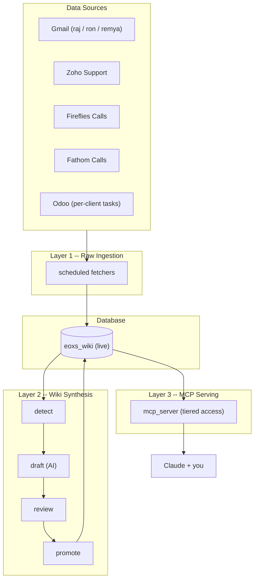
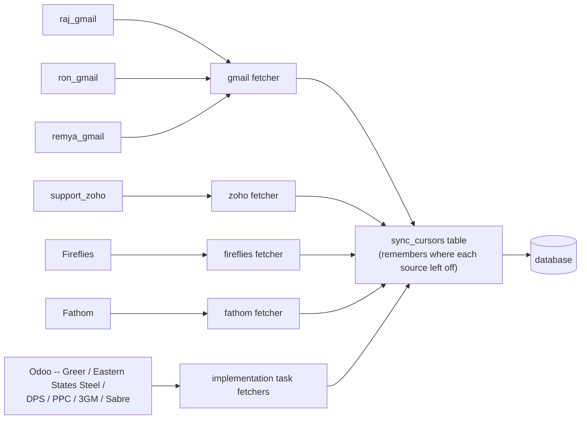
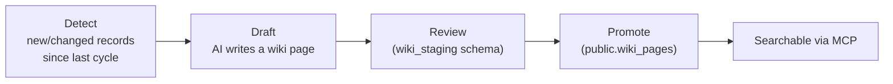
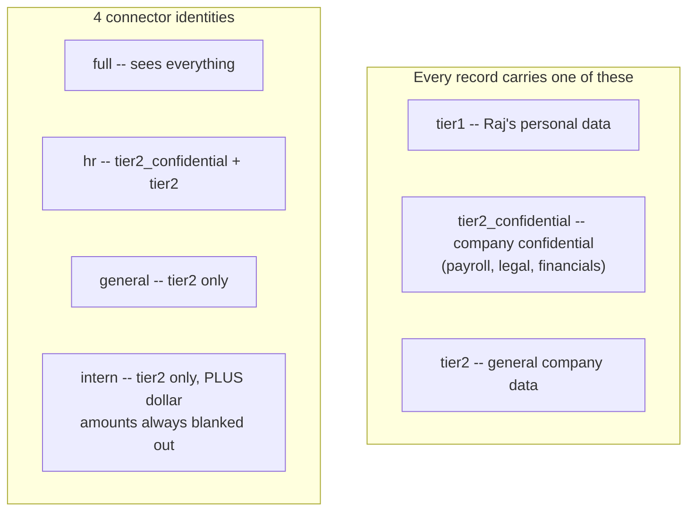

# Tier 1 — Orientation Scripts

Six videos, ~5-8 min each, watched in order. Record with OBS in screen-capture
mode; narrate live over what's on screen rather than writing full prose —
these are talking-point outlines.

---

## Video 1 — What is Cruz, and why does it exist (~5 min)

**Goal:** hook a zero-context viewer before any mechanism is explained.

**Before you record:** have a Claude.ai conversation open with an MCP
connector already attached and ready to send a real question.

**Talking points, in order:**

1. Open cold on the problem, not the solution: "Before this existed, if you
   wanted to know the history of a client, you were digging through three
   different Gmail inboxes, a support desk, call recordings, and an Odoo
   board — and hoping you found everything."
2. `[SHOW: the Claude chat, ask a real question — e.g. "What's the status of
   Eastern States Steel's EOXS onboarding?" — let the real answer come back
   on screen.]` Don't explain how it worked yet. Let it be a little bit
   impressive first.
3. "This is Cruz. It's a second brain for EOXS — everything that happened
   across email, calls, and support/implementation work, in one place you
   can just ask."
4. Name the pieces without explaining them yet: "Under the hood it's a
   database, a pipeline that turns raw messages into readable knowledge, and
   a connector that lets Claude answer from it. That's literally the rest of
   this series — one video per piece."
5. `[SHOW: the full architecture diagram from Video 2, just a 2-3 second
   glance]` "Here's the shape of it — we'll go through it top to bottom
   starting next video."

---

## Video 2 — The three-layer architecture (~7-8 min)

**Goal:** the mental model every later video hangs off. This is the most
important video in the series — take the extra take if needed.

**Before you record:** pick one real, already-processed email or call you
can show at all three stages (raw record → wiki page → Claude answer) —
picking this in advance saves fumbling for an example mid-recording.

**Diagram to show full-screen for most of this video:**

**Talking points:**

1. `[SHOW: full diagram]` "Three layers, and information only flows one
   direction through them: raw ingestion, wiki synthesis, then serving."
2. **Layer 1 — Raw ingestion.** "Every few hours, a set of scripts reach out
   to every source — Gmail, Zoho, Fireflies, Fathom, Odoo — and pull in
   anything new. This layer doesn't interpret or summarize anything, it just
   faithfully records what came in."
3. **Layer 2 — Wiki synthesis.** "Separately, a pipeline reads what raw
   ingestion collected and has an AI draft a synthesized page — a real
   summary of a client or topic, pulling together everything relevant. Drafts
   get reviewed before they're promoted live."
4. **Layer 3 — MCP serving.** "This is the layer you actually talk to. A
   small server exposes specific tools — search the wiki, get a client
   profile — and Claude calls those tools when you ask it something."
5. **Walk one real example through all three layers** — this is the payoff:
   - `[SHOW: the raw record — e.g. the actual email or call in the
     database]` "Here's where it started."
   - `[SHOW: the wiki page it became]` "Here's what the synthesis layer
     turned it into."
   - `[SHOW: the Claude answer using it]` "And here's it being used to
     actually answer a question."
6. Close: "Every video from here is a deep dive into one of these three
   layers, in order."

---

## Video 3 — Where the data comes from (raw ingestion layer) (~8 min)

**Goal:** understand every source and that this runs unattended, not by hand.

**Before you record:** have a terminal ready in the repo with the venv
active; know one fetcher you can safely run with `--dry-run --limit 5`.

**Diagram:**

**Talking points:**

1. `[SHOW: diagram]` List the sources out loud while pointing at each box:
   three separate Gmail inboxes (raj, ron, remya — different people, kept
   separate), the Zoho support desk, Fireflies and Fathom (two different call
   recorders — Fireflies for general/sales calls, Fathom mostly Ron's),
   and per-client Odoo boards tracking onboarding/implementation work for
   each of EOXS's client accounts.
2. "None of this is triggered by a person clicking a button. It runs on a
   schedule, unattended, all day."
3. `[SHOW: terminal — run a fetcher in dry-run mode, e.g.
   python -m ingestion.fireflies_fetcher --dry-run --limit 5]` Narrate the
   log lines as they scroll: "See it pulling candidates, checking whether
   we've already got each one, filtering out anything irrelevant."
4. `[SHOW: a quick query — SELECT * FROM sync_cursors]` "This is how the
   system remembers where each source left off, so a run never has to
   reprocess everything from the beginning."
5. Mention (briefly, don't over-explain) that everything gets written to two
   copies of the database — live, and a staging mirror used for
   development/testing so nobody has to touch real production data to build
   something new.
6. Close: "Once it's in the database, it's just raw records — messages,
   transcripts, tasks. The next layer is what makes it actually readable."

---

## Video 4 — Raw data → wiki knowledge (synthesis layer) (~8 min)

**Goal:** understand the detect → draft → review → promote pipeline, and the
"staging" naming gotcha.

**Before you record:** find one page that exists in `wiki_staging` (drafted,
not yet promoted) and, ideally, one promoted `public.wiki_pages` page you can
show side by side with its raw source.

**Diagram:**

**Talking points:**

1. `[SHOW: diagram]` Walk the four stages left to right, one sentence each:
   detect what's new, draft a page from it, review the draft, promote it live.
2. `[SHOW: a raw email/call side by side with the wiki page it became]` This
   is the payoff moment for the whole video — spend real time on it. "Notice
   this isn't just a copy-paste — it's pulled together with other context
   about the same client/topic."
3. **Flag the naming gotcha explicitly** — it trips everyone up once: "There
   are two different things both called 'staging' in this system. One is a
   whole separate *database* used for local development. The other is a
   *schema* inside the real database, called `wiki_staging`, which is just
   the draft-review workspace before a page goes live. Different things,
   same word — worth remembering now so it doesn't confuse you later."
4. `[SHOW: a page still sitting in wiki_staging, not yet promoted]` "This one
   hasn't been promoted yet — it won't show up if you search the wiki through
   Claude until it clears review."
5. `[SHOW: the Linear "EDB" board]` "Every cycle also reports itself here, so
   anyone can see what got drafted and promoted without needing database
   access at all."
6. Close: "Now the wiki has real knowledge in it. But not everyone who asks a
   question should see everything in it — that's next."

---

## Video 5 — Access tiers & redaction (~6-7 min)

**Goal:** the single most important "aha" moment in the series — spend the
extra time getting the live side-by-side demo right.

**Before you record:** have two different MCP connections open and ready
(e.g. `general` and `hr`, or `general` and `intern`) so you can ask the exact
same question through both without fumbling to reconnect mid-recording.

**Diagram:**

**Talking points:**

1. `[SHOW: diagram]` "Every single record in the system carries a tag saying
   who's allowed to see it. Three tags, and four different connector
   identities that see different combinations of them."
2. Explain the *why*, plainly: "Not everyone should see Raj's personal stuff.
   Not everyone should see payroll numbers. But everyone reasonably needs the
   general company knowledge — that's what the tiers are for."
3. `[SHOW: the same question asked through two different connections, side by
   side or back to back]` — the money shot: "Same exact question. One
   connection gets the real number. The other gets `[restricted]`, or a plain
   'not found.'"
4. Explain the two safety layers, briefly: "It's not just one gate — the
   database itself won't hand over a row above your clearance, and on top of
   that, an AI double-checks the actual text of what's about to be returned
   and blanks out anything sensitive it finds, even inside an otherwise
   allowed record."
5. Mention the "not found" design choice — good detail for interns to
   internalize before they test the system themselves: "If something doesn't
   exist, or it exists but you're not cleared to see it, you get the exact
   same 'not found' either way — on purpose, so nobody can fish for whether
   something restricted exists just by trying different phrasings."
6. Close: "Now you know why the system holds back what it holds back. Last
   video — actually using it."

---

## Video 6 — Using the system day to day (~8 min)

**Goal:** practical, confident usage. Sets up whichever Tier 2 role-specific
videos come next for this person.

**Before you record:** have 4-5 realistic questions picked out in advance —
ones an intern would genuinely ask in their first week.

**Talking points:**

1. Brief mention, don't dwell: "You'll get your own connector link when
   you're onboarded, scoped to exactly what your role needs — matches what
   we just covered in the tiers video."
2. `[SHOW: live Claude chat]` Ask 4-5 real questions back to back, letting
   full real answers come back each time — e.g. "tell me about [a client]",
   "what came up on the last call with [someone]", "has this topic come up
   before", "what's the status of [an implementation task]."
3. Narrate lightly as answers come back, tying back to earlier videos: "That
   one call just did what we saw in video 2/3/4 — it's pulling from the wiki
   plus raw records and stitching them together."
4. Point out an efficiency detail: "Notice it usually doesn't run five
   separate searches for a client question — one good call gets most of the
   picture in one shot."
5. `[SHOW: a restricted/not-found example, live]` tie directly back to video
   5: "And there's tiering in action again."
6. Close the whole series: "That's the full system, start to finish — where
   data comes from, how it becomes knowledge, why some things are hidden, and
   how you actually use it. From here you'll get one or two more videos
   specific to what you're actually assigned to — but everything in those
   builds on exactly what you just watched."
